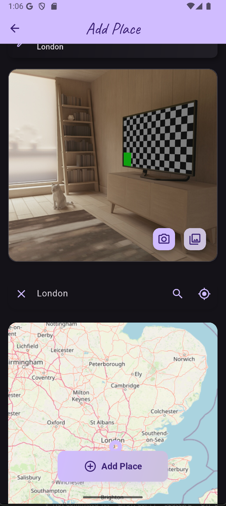
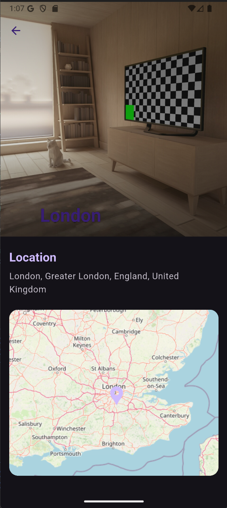

# places

App on Flutter to store places.

## App Screenshots

<p float="left">
  
  
  
  
</p>

## Features

- Preview list of places
- View place details
- Add new place
- Pick an image
- Find location on map or by address
- Preview location on map
- Change app theme (dark, light, system)

## Installation & Running

1. Clone repository

```bash
git clone https://github.com/Hati0kooHati/places.git
cd places
```

2. Download dependencies

```bash
flutter pub get
```

3. Running

```bash
flutter run
```

## Technologies

- Flutter 3.32.4 (stable)
- Dart 3.8.1
- google_fonts 6.2.1
- flutter_riverpod 2.6.1
- uuid 4.5.1
- image_picker 1.1.2
- location 8.0.1
- http 1.4.0
- path_provider 2.1.5
- path 1.9.1
- sqflite 2.4.2
- flutter_map 8.2.1
- latlong20.9.1
- shared_preferences 2.5.3

## Contacts

If you have any questions, feel free to email me: dserion.prn@gmail.com

## License

This project is licensed under the MIT License.
